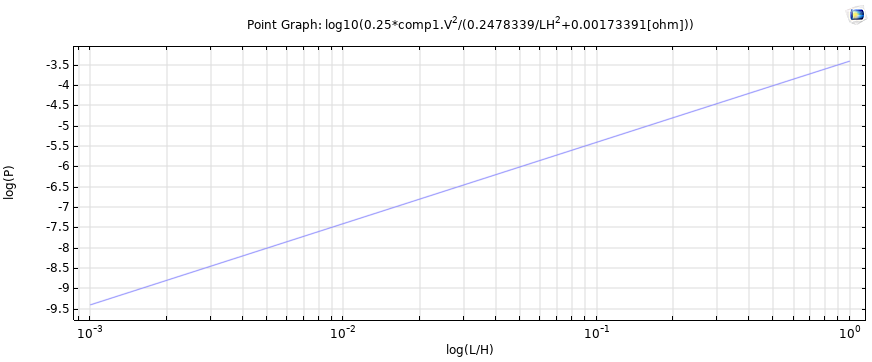
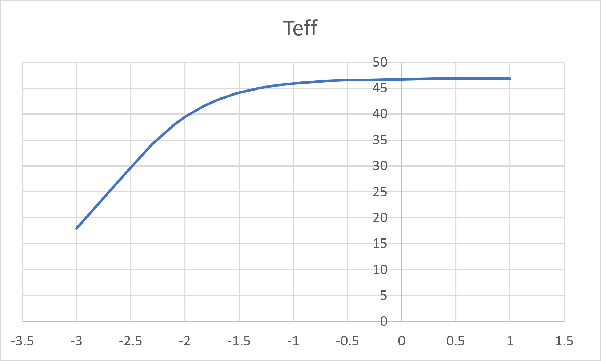
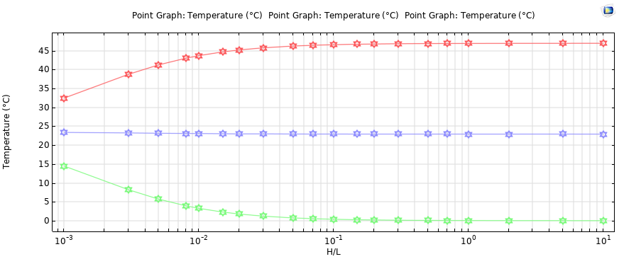
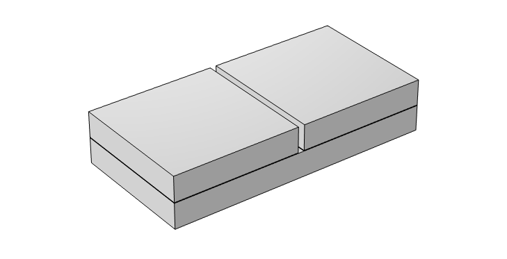
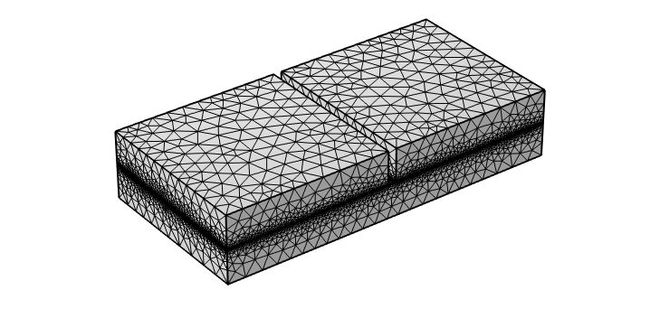

# Thermoelectric Generator – COMSOL Study

A numerical study of a thermoelectric generator/module using COMSOL Multiphysics, focusing on thermal and electrical behavior and the effect of the H/L geometric ratio on thermoelectric performance.

> **Project Status:** 🚧 In Progress

---

## Overview

This project investigates the performance of a thermoelectric module using a coupled thermal–electrical COMSOL Multiphysics model.

The study focuses on the relationship between module geometry, temperature distribution, and electrical power output. A parametric study is performed by varying the H/L ratio, where H represents the thermoelectric leg height and L represents the characteristic leg length.

The model is developed with reference to published research on Bi₂Te₂.₇₀Se₀.₃₀ thermoelectric modules and COMSOL-based simulation.

---

## Objectives

The main objectives of this project are:

- Develop a 3D thermoelectric module model in COMSOL Multiphysics.
- Analyze coupled thermal and electrical behavior.
- Study temperature distribution within the thermoelectric module.
- Investigate the electrical response of the module.
- Perform a parametric study by varying the H/L ratio.
- Analyze the effect of H/L on output power.
- Identify the region corresponding to maximum power output.
- Compare the numerical trends with published research.
- Perform mesh and convergence verification.

---

## Software Used

- COMSOL Multiphysics
- Heat Transfer in Solids
- Electric Currents
- Thermoelectric Effect
- Stationary Study

---

## Model Description

The thermoelectric module consists of:

- **Bi₂Te₂.₇₀Se₀.₃₀** thermoelectric material
- **Copper (Cu)** electrical conductors
- **Al₂O₃** ceramic/insulating material

The model uses a coupled thermal and electrical formulation to evaluate the thermoelectric response of the module.

### Physics Interfaces

The following COMSOL physics interfaces are used:

1. Heat Transfer in Solids
2. Electric Currents
3. Thermoelectric Effect

The model is solved using a **Stationary Study**.

---

## Parametric Study

A parametric study is performed by varying the **H/L ratio** of the thermoelectric geometry.

The main quantities investigated are:

- Output power
- Effective temperature
- Temperature distribution
- Temperature difference across the module
- Electrical response

The purpose of the parametric study is to understand how the thermoelectric geometry influences the overall performance of the module.

---

## Current Results

### Power vs H/L

The calculated output power initially increases with H/L and reaches a maximum region before decreasing at larger H/L values.


---

### Power – Logarithmic Plot

A logarithmic representation of the power variation is also included to examine the trend over the investigated H/L range.



---

### Effective Temperature

The effective temperature shows an increasing trend with the investigated H/L ratio.



---

### Temperature vs H/L

The temperature response of different regions of the thermoelectric module is investigated as a function of H/L.



---

## Preliminary Observations

From the current simulation results:

- Output power is strongly dependent on the H/L ratio.
- Power increases initially with increasing H/L.
- A maximum-power region is observed within the investigated range.
- The effective temperature changes with H/L.
- Different regions of the thermoelectric module exhibit different temperature trends.
- Further mesh and convergence analysis is required before considering the results final.

> **Note:** The current results are preliminary because mesh independence, convergence, and detailed comparison with the reference study are still being evaluated.

---

## Model Geometry

The 3D geometry of the thermoelectric module is shown below.



---

## Mesh

The model uses a finite-element mesh generated in COMSOL Multiphysics.



Mesh refinement and convergence verification will be performed during the later stages of the study.

---

## Workflow

```text
Geometry Creation
        ↓
Material Assignment
        ↓
Heat Transfer Physics
        ↓
Electric Currents Physics
        ↓
Thermoelectric Coupling
        ↓
Boundary Conditions
        ↓
Mesh Generation
        ↓
Stationary Study
        ↓
H/L Parametric Study
        ↓
Temperature Analysis
        ↓
Power Analysis
        ↓
Optimization & Validation
